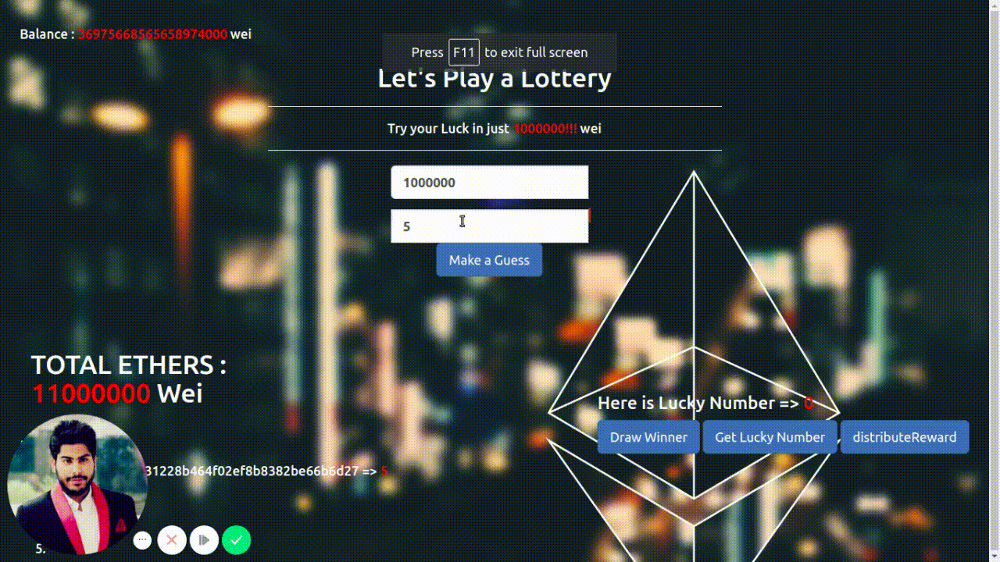

# LotteryDapp
Lottery DApp-is a lottery web app in which a user can guess a number between 1 an d 20. The onwer of the contract will draw a winner after every round of lottery. I made this lottery to experiment with and get a grasp of the full-stack process behind creating Ethereum DApps.

# Features:

• Works with the Metamask wallet.

• A simple but functional front-end built with Bootstrap.

• Integration with all major Ethereum testnets.

• A blockchain-based randomness generator to ensure fairness.

# Technologies Used:

• Solidity

• Truffle

• Ganache-Cli

• Web3.js

• Node.js

• HTML/CSS

• Bootstrap

• JQuery
